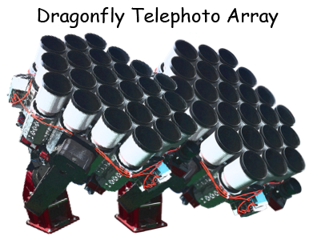

# MRF: Multi-Resolution Filtering
Multi-Resolution Filtering: a method for isolating faint, extended emission in [Dragonfly](http://dragonflytelescope.org) data and other low resolution images.

<p align="center">
  
</p>

Applications
------------
- Download corresponding high resolution image (HSC, CFHT) of given Dragonfly image.
- Generate kernels to match high resolution image with low resolution one.
- Characterize and subtract stellar halos in Dragonfly image.
- Documentation is on its way :car: :airplane:

Examples
------------

This example shows the tidal feature of NGC 5907, described in [van Dokkum et al. (2019)](https://ui.adsabs.harvard.edu/abs/2019arXiv190611260V/abstract). The images presented there just used this algorithm. Full resolution Dragonfly images and MRF results can be found [here](https://www.pietervandokkum.com/ngc5907). Check [this notebook](https://github.com/AstroJacobLi/mrf/blob/master/examples/mrfTask-n5907.ipynb) for more details in how to do MRF using this Python package! :rocket: 


This example shows how powerful MRF is in extracting low surface brightness features. The ultra-diffuse galaxy M101-DF3 is revealed by MRF after subtracting compact objects and bright star halos according to [van Dokkum et al. (in prep)](https://www.pietervandokkum.com). Check [this notebook](https://github.com/AstroJacobLi/mrf/blob/master/examples/mrfTask-m101df3.ipynb) for more details.


You can also use [this script](https://github.com/AstroJacobLi/mrf/blob/master/examples/mrf-task.py) to run the MRF task. Take NGC 5907 as an example:

```bash
python mrf-task.py n5907_df_g.fits ngc5907_cfht_g.fits ngc5907_cfht_r.fits ngc5907-task.yaml --gal='gal_cat_n5907.txt' --output='n5907_g'
```

Installation
------------

```bash
cd <install dir>
git clone git@github.com:AstroJacobLi/mrf.git
cd mrf
python setup.py install
```

If you don't have `git` configured, you can also download the `zip` file directly from https://github.com/AstroJacobLi/mrf/archive/master.zip, then unzip it and install in the same way. 

**You need to export the path of `mrf` as an environment variable**, so open `~/.bash_profile` (or `~/.bashrc`), and write `export PYTHONPATH=$PYTHONPATH:"<install dir>"` to it. Don't forget to validate it by `. ~/.bash_profile`.

Then import `mrf` in Python:

```python
import mrf
print(mrf.__file__.rstrip('__init__.py') + 'iraf/macosx/') 
# It should be "<install dir>/mrf/mrf/iraf/macosx/"
# otherwise the environmental variable is not set correctly.
```

`Python>=3` is needed, but you can try whether `mrf` still works under `python2`. Check out the dependence of `mrf` depends from `requirements.txt`.

TODO
------------
- Analyze color terms between Dragonfly, CFHT, DES, HSC, etc.

Acknowledgement
---------------
Many scripts and snippets are from [`kungpao`](https://github.com/dr-guangtou/kungpao) (written by [Song Huang](http://dr-guangtou.github.io) and [Jiaxuan Li](http://astrojacobli.github.io)). Here we acknowledge [@dr-guangtou](https://github.com/dr-guangtou) for his help!


Citation
-------
If you use this code, please reference the `doi` below, and make sure to cite the dependencies as listed in [requirements](https://github.com/AstroJacobLi/mrf/blob/master/requirements.txt). 

`mrf` is a free software made available under MIT License. For details see the LICENSE file. 

Copyright 2019 [Pieter van Dokkum](http://pietervandokkum.com) and [Jiaxuan Li](http://astrojacobli.github.io). 